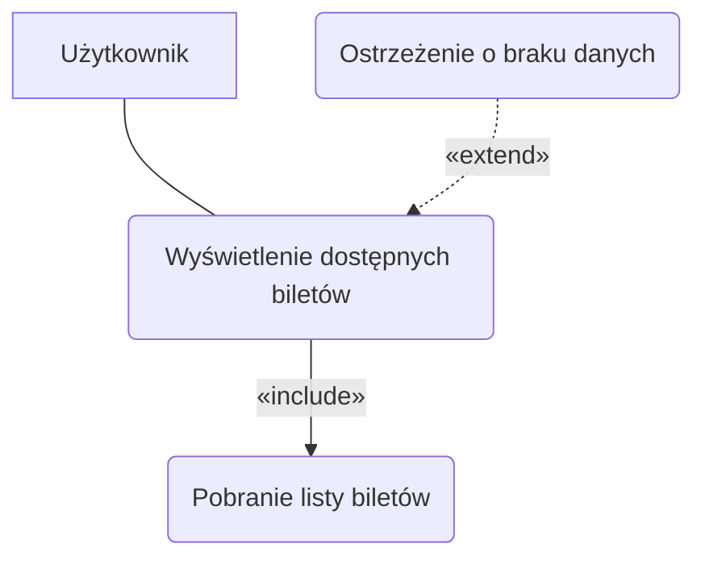
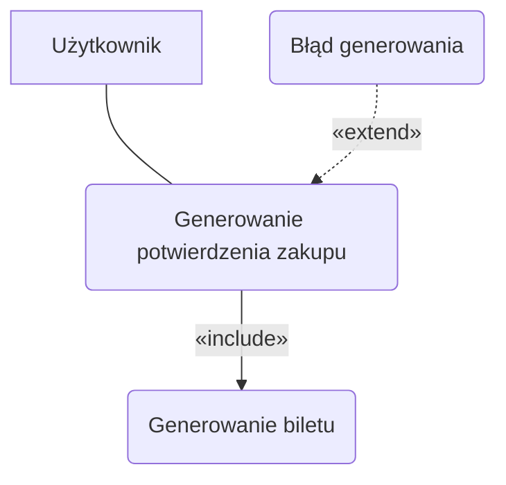

## Diagramy przypadków użycia

### Wyświetlenie dostępnych biletów

```mermaid
flowchart TD
    Uzer[Użytkownik]

    UC1(Wyświetlenie dostępnych biletów)
    UC2(Pobranie listy biletów)
    UC3(Ostrzeżenie o braku danych)

    Uzer --- UC1
    
    UC1 -->|«include»| UC2
    
    UC3 -.->|«extend»| UC1

```

### Generowanie potwierdzenia zakupu

```mermaid
flowchart TD
    Uzer[Użytkownik]

    UC1(Generowanie potwierdzenia zakupu)
    UC2(Generowanie biletu)
    UC3(Błąd generowania)

    Uzer --- UC1
    
    UC1 -->|«include»| UC2
    
    UC3 -.->|«extend»| UC1
```
