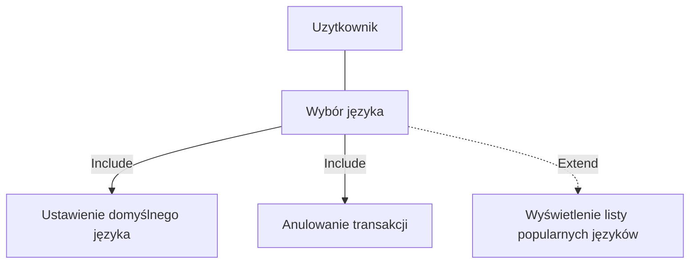
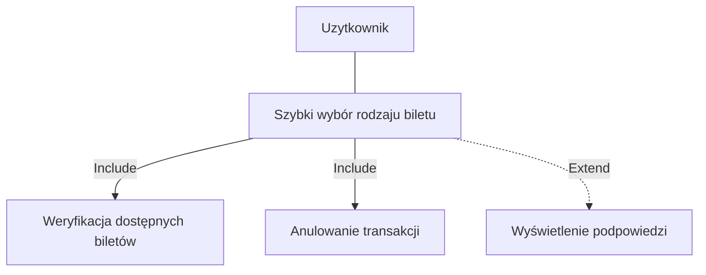
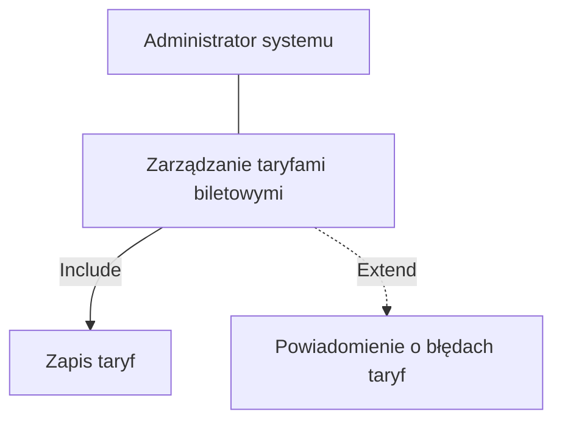
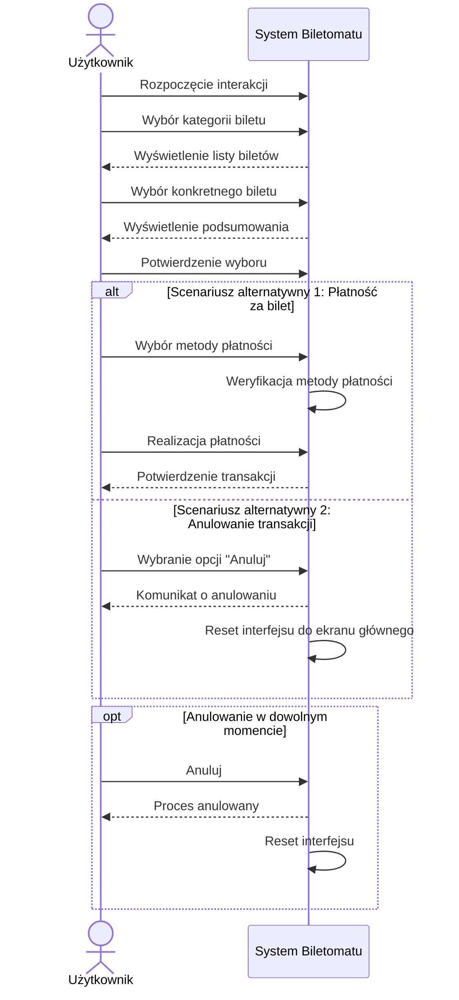
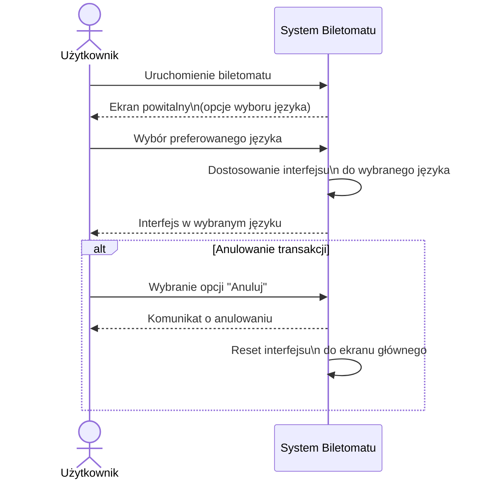

## Diagramy przypadków użycia

### Wybór języka

### Szybki wybór rodzaju biletu

### Zarządzanie taryfami biletowymi

### Zarządzanie dostępnością biletów

## Diagramy sekwencji
### Scenariusz
Szybki wybór rodzaju biletu Opis krokowy: 
1. Użytkownik podchodzi do biletomatu (Rozpoczęcie interakcji).
2. Użytkownik wybiera kategorię biletu (np. jednorazowe, okresowe) (Wybór kategorii).
3. Użytkownik wybiera konkretny bilet z dostępnej listy (Wybór biletu).
4. System wyświetla podsumowanie wyboru (Wyświetlenie podsumowania).
5. Użytkownik przechodzi do realizacji transakcji (Potwierdzenie wyboru).
6. Użytkownik w dowolnym momencie może anulować proces (Anulowanie transakcji).
Scenariusz alternatywny 1:
Płatność za bilet Opis krokowy:
1. Użytkownik wybiera metodę płatności (karta, gotówka, telefon) (Wybór metody płatności).
2. System weryfikuje dostępność wybranej metody (Weryfikacja metody płatności).
3. Użytkownik dokonuje płatności (np. wprowadza kartę, gotówkę, korzysta z NFC) (Realizacja płatności).
4. System potwierdza zakończenie transakcji (Potwierdzenie transakcji).
5. Użytkownik w dowolnym momencie może anulować proces (Anulowanie transakcji).
Scenariusz alternatywny 2:
Anulowanie transakcji Opis krokowy:
1. Użytkownik rozpoczyna proces zakupu biletu (Rozpoczęcie interakcji).
2. W dowolnym momencie użytkownik wybiera opcję "Anuluj" (Wybranie opcji anulowania).
3. System wyświetla komunikat potwierdzający anulowanie transakcji (Komunikat o anulowaniu).
4. System resetuje interfejs do ekranu głównego (Reset interfejsu).

### Szybki wybór rodzaju biletu

### Scenariusz
Wybór języka
Opis krokowy:
1. Użytkownik uruchamia biletomat (Rozpoczęcie interakcji).
2. System wyświetla ekran powitalny z opcjami wyboru języka (Wyświetlenie opcji
języka).
3. Użytkownik wybiera preferowany język (Wybór języka).
4. System dostosowuje interfejs do wybranego języka (Dostosowanie interfejsu).
5. Użytkownik w dowolnym momencie może anulować proces (Anulowanie
transakcji).
Scenariusz alternatywny:
Anulowanie transakcji
Opis krokowy:
1. Użytkownik rozpoczyna proces zakupu biletu (Rozpoczęcie interakcji).
2. W dowolnym momencie użytkownik wybiera opcję "Anuluj" (Wybranie opcji
anulowania).
3. System wyświetla komunikat potwierdzający anulowanie transakcji (Komunikat
o anulowaniu).
4. System resetuje interfejs do ekranu głównego (Reset interfejsu)

### Wybór języka

