## Diagramy przypadków użycia

### Wybór języka

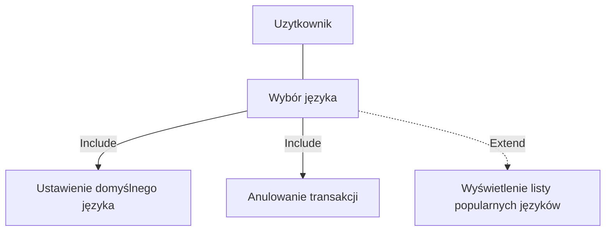


### Szybki wybór rodzaju biletu

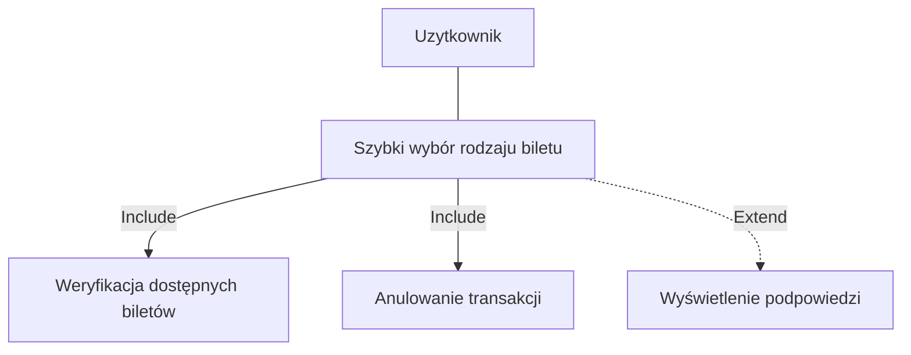
### Zarządzanie taryfami biletowymi

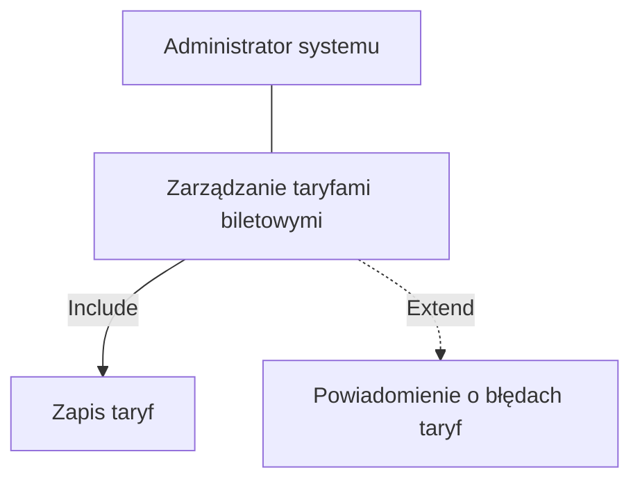
### Zarządzanie dostępnością biletów
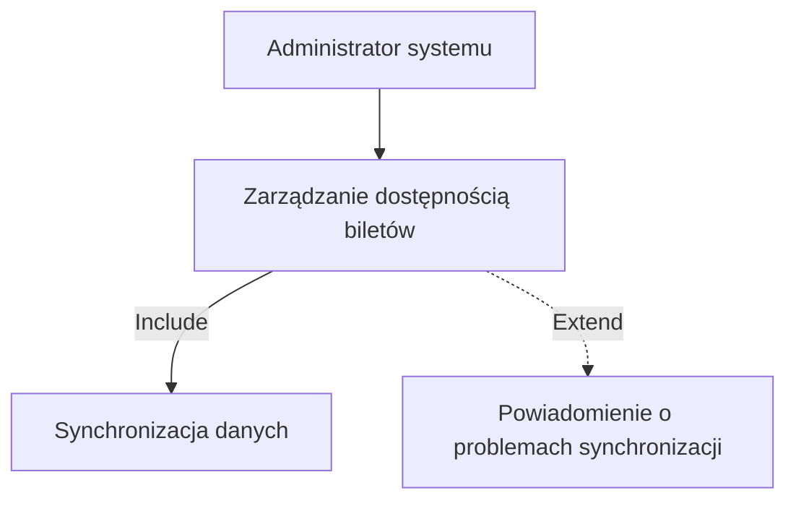

### Wyświetlenie dostępnych biletów

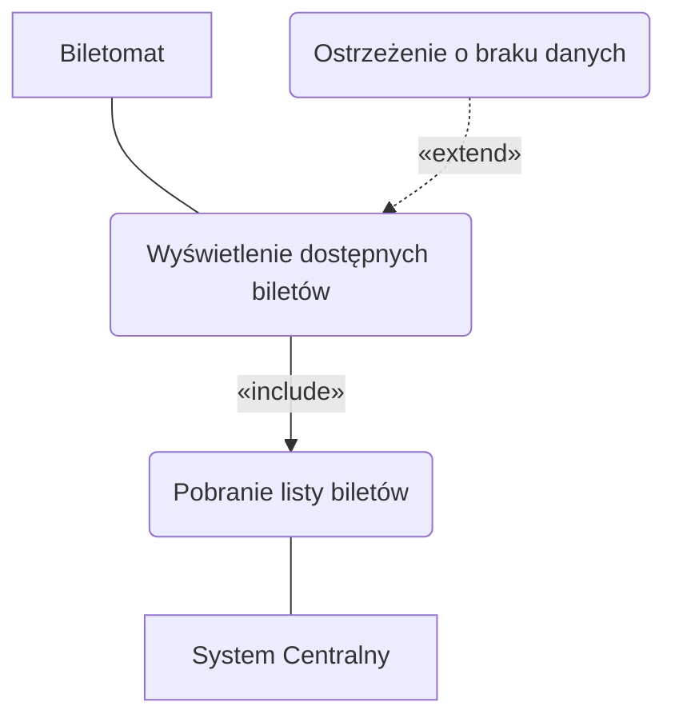

### Generowanie potwierdzenia zakupu

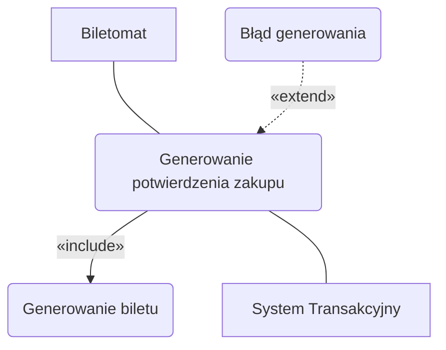

## DIAGRAMY SEKWENCJI

### DIAGRAM SEKWENCJI DLA PRZYPADKU UŻYCIA GENEROWANIA POTWIERDZENIA ZAKUPU
- AKTOR: BILETOMAT
- OBIEKTY: SYSTEM TRANSAKCYJNY, MODUŁ DRUKOWANIA, INTERFEJS UŻYTKOWNIKA, UŻYTKOWNIK
- KOLEJNOŚĆ KOMUNIKATÓW (SCENARIUSZ GŁÓWNY):
 
  o SYSTEM TRANSAKCYJNY WYSYŁA POTWIERDZENIE TRANSAKCJI DO BILETOMATU.
  
  o BILETOMAT PRZEKAZUJE ŻĄDANIE DO MODUŁU DRUKOWANIA.
  
  o MODUŁ DRUKOWANIA GENERUJE BILET I ZWRACA STATUS DO BILETOMATU.
  
  o BILETOMAT INFORMUJE UŻYTKOWNIKA PRZEZ INTERFEJS: "ODBIERZ BILET".
  
  o UŻYTKOWNIK ODBIERA BILET.
  
  o BILETOMAT POTWIERDZA ZAKOŃCZENIE DO SYSTEMU TRANSAKCYJNEGO.
  
- SCENARIUSZ ALTERNATYWNY 1 (BŁĄD GENEROWANIA):
  
  o MODUŁ DRUKOWANIA WYKRYWA BŁĄD (BRAK PAPIERU/AWARIA).
  
  o MODUŁ DRUKOWANIA ZWRACA STATUS BŁĘDU DO BILETOMATU.
  
  o BILETOMAT WYŚWIETLA UŻYTKOWNIKOWI: "BŁĄD. SKONTAKTUJ SIĘ Z OBSŁUGĄ".
  
  o BILETOMAT WYSYŁA POWIADOMIENIE O BŁĘDZIE DO SYSTEMU TRANSAKCYJNEGO.

```mermaid
sequenceDiagram
    participant ST as System Transakcyjny
    participant B as Biletomat
    participant MD as Moduł Drukowania
    participant IU as Interfejs Użytkownika
    participant U as Użytkownik

    ST->>B: Potwierdzenie transakcji
    B->>MD: Żądanie generowania biletu
    
    alt Scenariusz główny
        MD-->>B: Bilet gotowy
        B->>IU: Komunikat o odbiorze
        IU->>U: "Odbierz bilet"
        U-->>U: Odbiór biletu
        IU-->>B: Potwierdzenie
        B->>ST: Transakcja zakończona
        ST-->>B: OK
    else Błąd generowania
        MD-->>B: Status błędu
        B->>IU: Komunikat o błędzie
        IU->>U: "Błąd. Skontaktuj się z obsługą"
        B->>ST: Powiadomienie o błędzie
        ST-->>B: OK
    end
  ```


## Diagramy sekwencji
### Scenariusz
Szybki wybór rodzaju biletu Opis krokowy: 
1. Użytkownik podchodzi do biletomatu (Rozpoczęcie interakcji).
2. Użytkownik wybiera kategorię biletu (np. jednorazowe, okresowe) (Wybór kategorii).
3. Użytkownik wybiera konkretny bilet z dostępnej listy (Wybór biletu).
4. System wyświetla podsumowanie wyboru (Wyświetlenie podsumowania).
5. Użytkownik przechodzi do realizacji transakcji (Potwierdzenie wyboru).
6. Użytkownik w dowolnym momencie może anulować proces (Anulowanie transakcji).
Scenariusz alternatywny 1:
Płatność za bilet Opis krokowy:
1. Użytkownik wybiera metodę płatności (karta, gotówka, telefon) (Wybór metody płatności).
2. System weryfikuje dostępność wybranej metody (Weryfikacja metody płatności).
3. Użytkownik dokonuje płatności (np. wprowadza kartę, gotówkę, korzysta z NFC) (Realizacja płatności).
4. System potwierdza zakończenie transakcji (Potwierdzenie transakcji).
5. Użytkownik w dowolnym momencie może anulować proces (Anulowanie transakcji).
Scenariusz alternatywny 2:
Anulowanie transakcji Opis krokowy:
1. Użytkownik rozpoczyna proces zakupu biletu (Rozpoczęcie interakcji).
2. W dowolnym momencie użytkownik wybiera opcję "Anuluj" (Wybranie opcji anulowania).
3. System wyświetla komunikat potwierdzający anulowanie transakcji (Komunikat o anulowaniu).
4. System resetuje interfejs do ekranu głównego (Reset interfejsu).

### Szybki wybór rodzaju biletu

```mermaid
sequenceDiagram
    actor Użytkownik
    participant Biletomat as System Biletomatu

    %% Scenariusz główny – Szybki wybór rodzaju biletu
    Użytkownik ->> Biletomat: Rozpoczęcie interakcji
    Użytkownik ->> Biletomat: Wybór kategorii biletu
    Biletomat -->> Użytkownik: Wyświetlenie listy biletów
    Użytkownik ->> Biletomat: Wybór konkretnego biletu
    Biletomat -->> Użytkownik: Wyświetlenie podsumowania
    Użytkownik ->> Biletomat: Potwierdzenie wyboru

    alt Scenariusz alternatywny 1: Płatność za bilet
        Użytkownik ->> Biletomat: Wybór metody płatności
        Biletomat ->> Biletomat: Weryfikacja metody płatności
        Użytkownik ->> Biletomat: Realizacja płatności
        Biletomat -->> Użytkownik: Potwierdzenie transakcji
    else Scenariusz alternatywny 2: Anulowanie transakcji
        Użytkownik ->> Biletomat: Wybranie opcji "Anuluj"
        Biletomat -->> Użytkownik: Komunikat o anulowaniu
        Biletomat ->> Biletomat: Reset interfejsu do ekranu głównego
    end

    opt Anulowanie w dowolnym momencie
        Użytkownik ->> Biletomat: Anuluj
        Biletomat -->> Użytkownik: Proces anulowany
        Biletomat ->> Biletomat: Reset interfejsu
    end
```

### Scenariusz
Wybór języka
Opis krokowy:
1. Użytkownik uruchamia biletomat (Rozpoczęcie interakcji).
2. System wyświetla ekran powitalny z opcjami wyboru języka (Wyświetlenie opcji
języka).
3. Użytkownik wybiera preferowany język (Wybór języka).
4. System dostosowuje interfejs do wybranego języka (Dostosowanie interfejsu).
5. Użytkownik w dowolnym momencie może anulować proces (Anulowanie
transakcji).
Scenariusz alternatywny:
Anulowanie transakcji
Opis krokowy:
1. Użytkownik rozpoczyna proces zakupu biletu (Rozpoczęcie interakcji).
2. W dowolnym momencie użytkownik wybiera opcję "Anuluj" (Wybranie opcji
anulowania).
3. System wyświetla komunikat potwierdzający anulowanie transakcji (Komunikat
o anulowaniu).
4. System resetuje interfejs do ekranu głównego (Reset interfejsu)

### Wybór języka
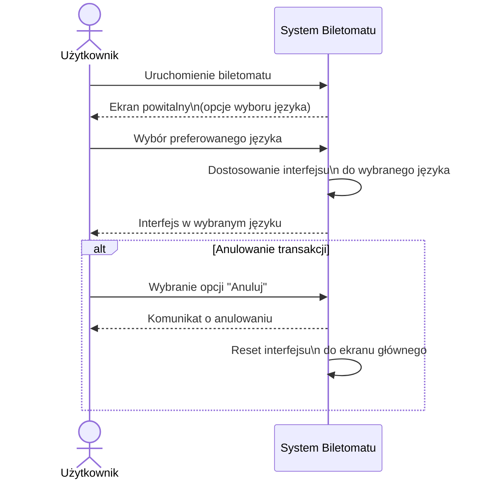


### Zarządzanie dostępnością biletów

#### Scenariusz do diagramu 
Aktor: Administrator
Obiekty: Interfejs zarządzania taryfami, Serwer aplikacji, Biletomaty

Scenariusz podstawowy
1. Administrator loguje się do systemu zarządzania taryfami.
2. Interfejs przesyła dane logowania do serwera.
3. Serwer przyznaje dostęp administratorowi.
4. Administrator wprowadza zmiany w taryfach biletowych.
5. Interfejs przesyła zmiany do serwera.
6. Serwer zapisuje zmiany i aktualizuje taryfy w biletomatach.
7. System informuje administratora o pomyślnym zakończeniu operacji.
Scenariusz alternatywny 1 – błąd aktualizacji taryf
1. Administrator wprowadza i zatwierdza zmiany w taryfach.
2. Serwer próbuje przesłać zaktualizowane taryfy do biletomatów.
3. Biletomaty nie potwierdzają aktualizacji.

System wyświetla administratorowi komunikat o błędzie aktualizacji taryf.
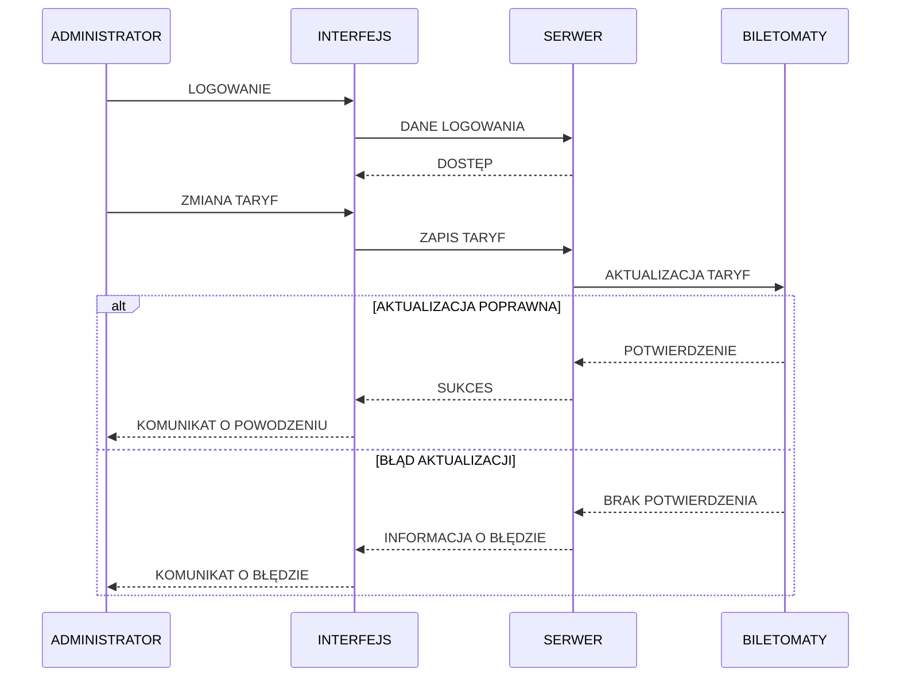

#### Scenariusz do diagramu 
Aktor: Administrator
Obiekty: Interfejs zarządzania biletami, Serwer aplikacji, Biletomaty, Aplikacja mobilna

Scenariusz podstawowy
1. Administrator loguje się do panelu zarządzania biletami.
2. Interfejs przesyła dane logowania do serwera aplikacji.
3. Serwer przyznaje administratorowi dostęp do systemu.
4. Administrator edytuje listę dostępnych biletów (dodaje lub usuwa bilety).
5. Interfejs przesyła zmiany do serwera aplikacji.
6. Serwer zapisuje zmiany w systemie centralnym.
7. System synchronizuje zaktualizowaną listę biletów z biletomatami oraz aplikacją mobilną.
8. Administrator otrzymuje informację o pomyślnym zakończeniu operacji.

Scenariusz alternatywny 1 – błąd synchronizacji listy biletów
1. Administrator zapisuje zmiany w liście biletów.
2. System próbuje zsynchronizować dane z biletomatami i aplikacją mobilną.
3. Synchronizacja nie powiodła się.
4. System wyświetla administratorowi komunikat o błędzie synchronizacji.


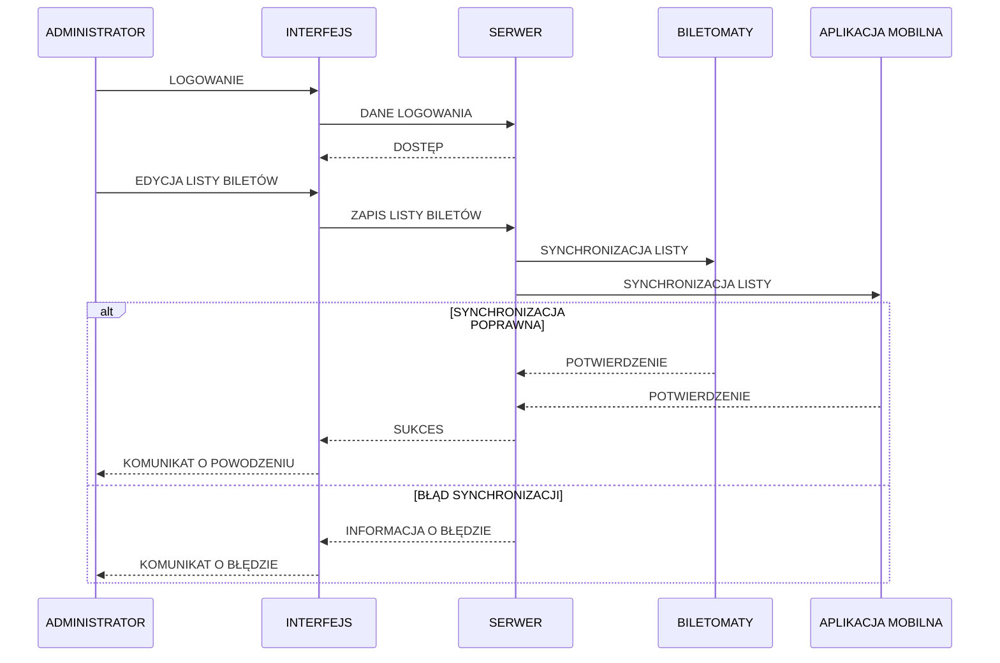

# DIAGRAMY KLAS
## DIAGRAM KLAS Z DIAGRAMU SEKWENCJI "Zarządzanie dostępnością biletów"
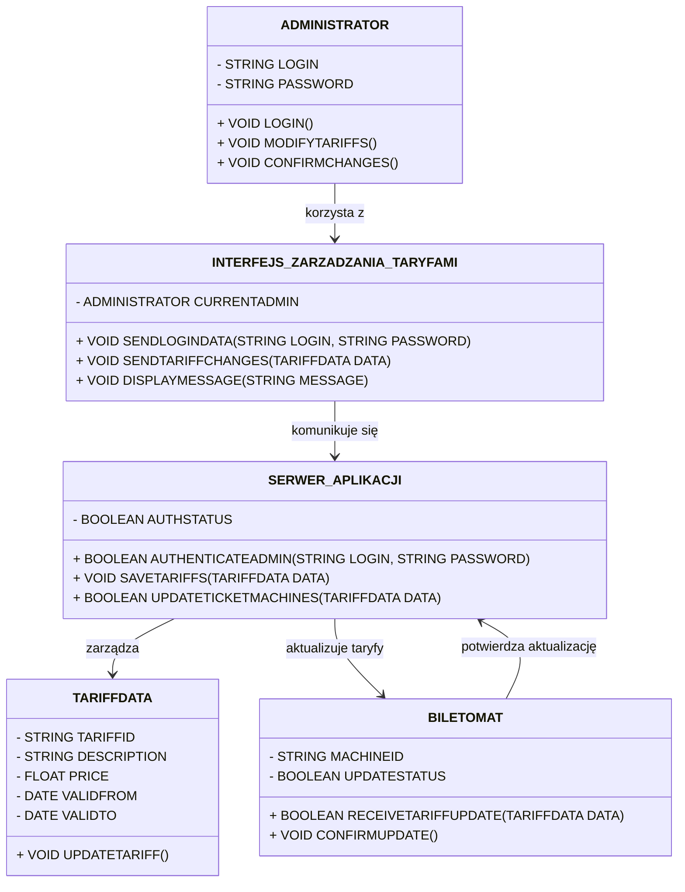

## DIAGRAM KLAS Z DIAGRAMU SEKWENCJI "Zarządzanie taryfami biletowymi"
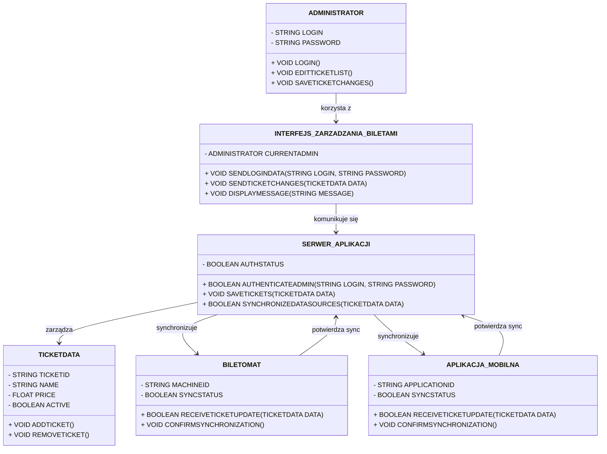

