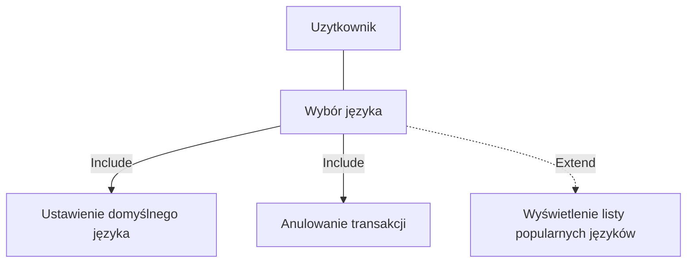
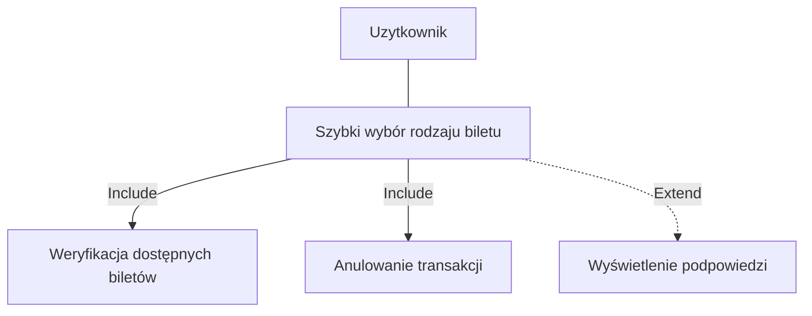
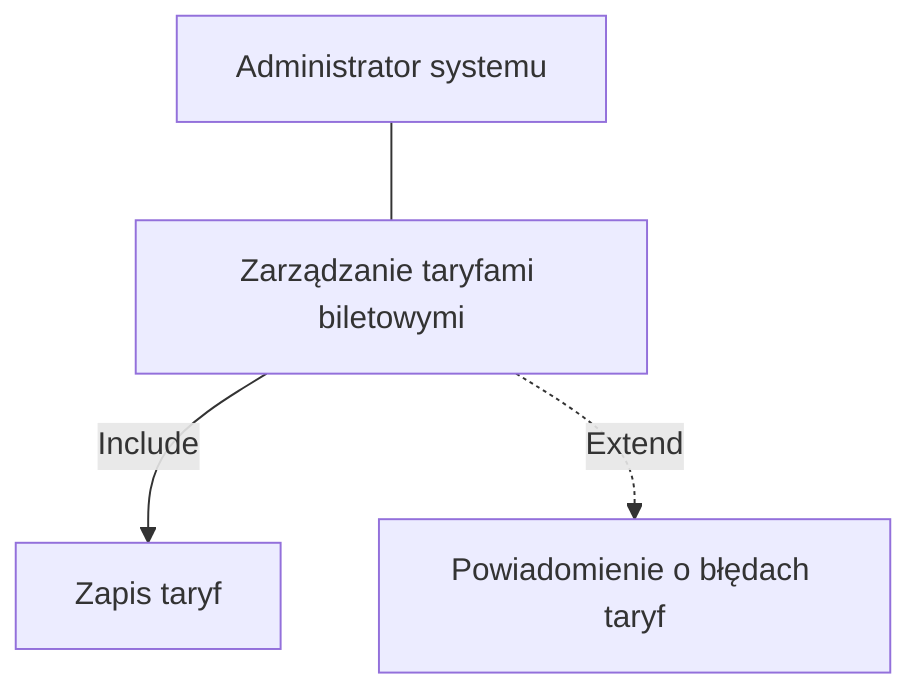

## Diagramy przypadków użycia

### Wybór języka

```mermaid
flowchart TD
    N[Uzytkownik] --- A[Wybór języka]

    A --> |Include| B[Ustawienie domyślnego języka]
    A --> |Include| C[Anulowanie transakcji]

    %% Relacja Extend (opcjonalna)
    A -.->|Extend| F[Wyświetlenie listy popularnych języków]
```

### Szybki wybór rodzaju biletu

```mermaid
flowchart TD
    N[Uzytkownik] --- A[Szybki wybór rodzaju biletu]

    A --> |Include| B[Weryfikacja dostępnych biletów]
    A --> |Include| C[Anulowanie transakcji]

    %% Relacja Extend (opcjonalna)
    A -.->|Extend| F[ Wyświetlenie podpowiedzi ]
```
### Zarządzanie taryfami biletowymi

```mermaid
flowchart TD
    N[Administrator systemu] 
    A[Zarządzanie taryfami biletowymi]
    B[Zapis taryf]
    C[Powiadomienie o błędach taryf]

    N --- A
    A -->|Include| B
    A -.->|Extend| C
```

### Zarządzanie dostępnością biletów

```mermaid
flowchart TD
    N[Administrator systemu]
    A[Zarządzanie dostępnością biletów]
    B[Synchronizacja danych]
    C[Powiadomienie o problemach synchronizacji]

    N --- A
    A -->|Include| B
    A -.->|Extend| C
```

