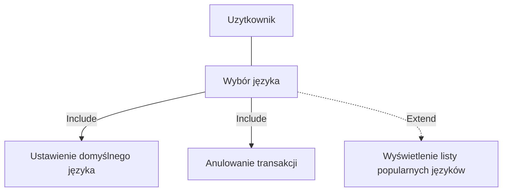
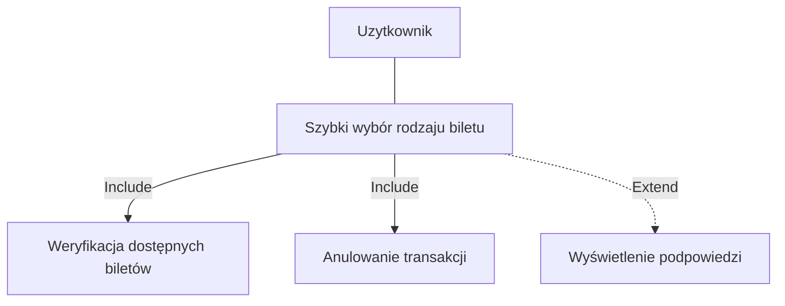
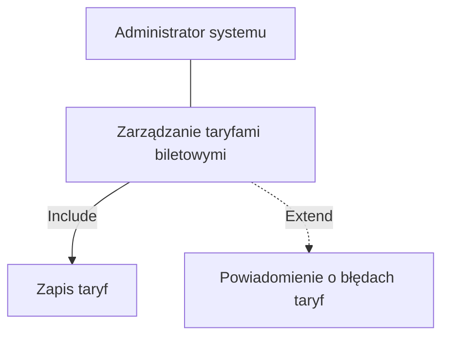
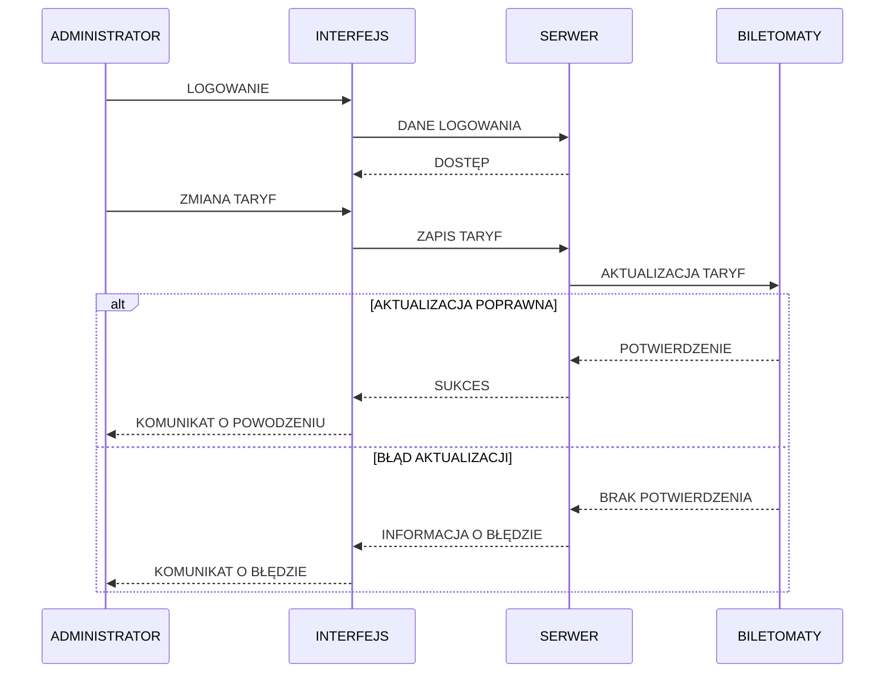
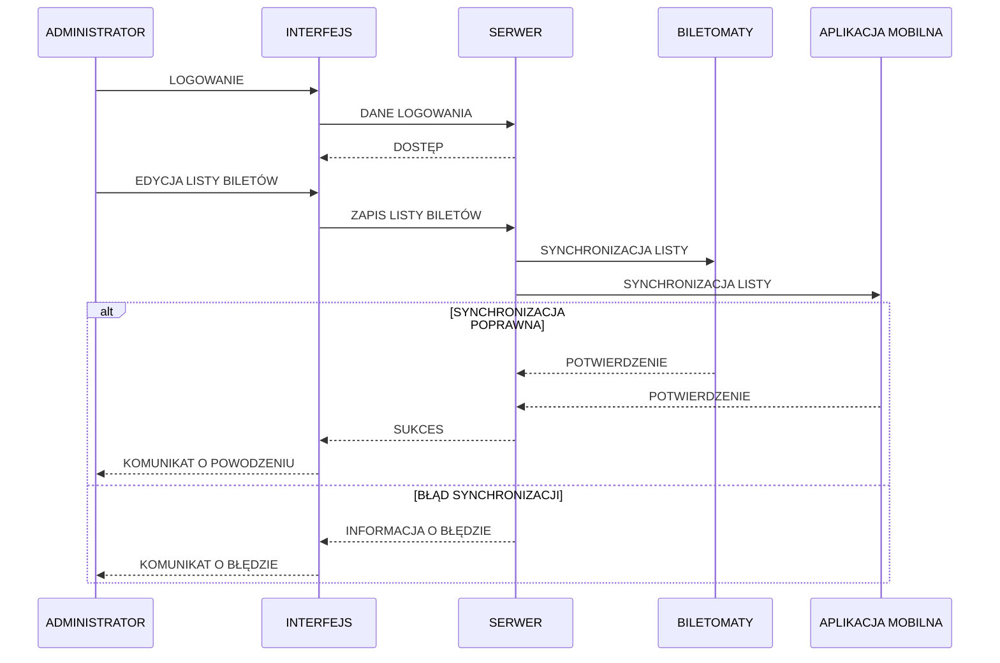

## Diagramy przypadków użycia

### Wybór języka

### Szybki wybór rodzaju biletu

### Zarządzanie taryfami biletowymi

### Zarządzanie dostępnością biletów

#### Scenariusz do diagramu 
Aktor: Administrator
Obiekty: Interfejs zarządzania taryfami, Serwer aplikacji, Biletomaty

Scenariusz podstawowy
1. Administrator loguje się do systemu zarządzania taryfami.
2. Interfejs przesyła dane logowania do serwera.
3. Serwer przyznaje dostęp administratorowi.
4. Administrator wprowadza zmiany w taryfach biletowych.
5. Interfejs przesyła zmiany do serwera.
6. Serwer zapisuje zmiany i aktualizuje taryfy w biletomatach.
7. System informuje administratora o pomyślnym zakończeniu operacji.
Scenariusz alternatywny 1 – błąd aktualizacji taryf
1. Administrator wprowadza i zatwierdza zmiany w taryfach.
2. Serwer próbuje przesłać zaktualizowane taryfy do biletomatów.
3. Biletomaty nie potwierdzają aktualizacji.

System wyświetla administratorowi komunikat o błędzie aktualizacji taryf.

### Zarządzanie dostępnością biletów

#### Scenariusz do diagramu 
Aktor: Administrator
Obiekty: Interfejs zarządzania biletami, Serwer aplikacji, Biletomaty, Aplikacja mobilna

Scenariusz podstawowy
1. Administrator loguje się do panelu zarządzania biletami.
2. Interfejs przesyła dane logowania do serwera aplikacji.
3. Serwer przyznaje administratorowi dostęp do systemu.
4. Administrator edytuje listę dostępnych biletów (dodaje lub usuwa bilety).
5. Interfejs przesyła zmiany do serwera aplikacji.
6. Serwer zapisuje zmiany w systemie centralnym.
7. System synchronizuje zaktualizowaną listę biletów z biletomatami oraz aplikacją mobilną.
8. Administrator otrzymuje informację o pomyślnym zakończeniu operacji.

Scenariusz alternatywny 1 – błąd synchronizacji listy biletów
1. Administrator zapisuje zmiany w liście biletów.
2. System próbuje zsynchronizować dane z biletomatami i aplikacją mobilną.
3. Synchronizacja nie powiodła się.
4. System wyświetla administratorowi komunikat o błędzie synchronizacji.

