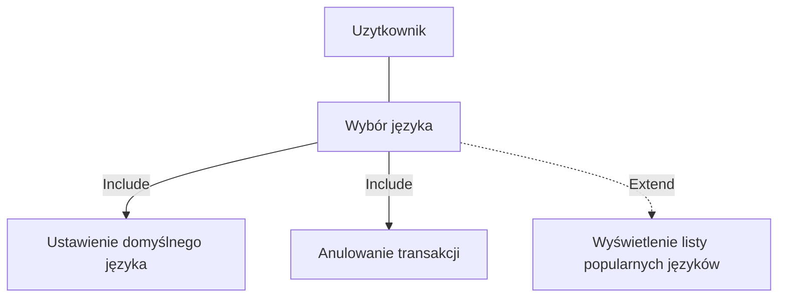
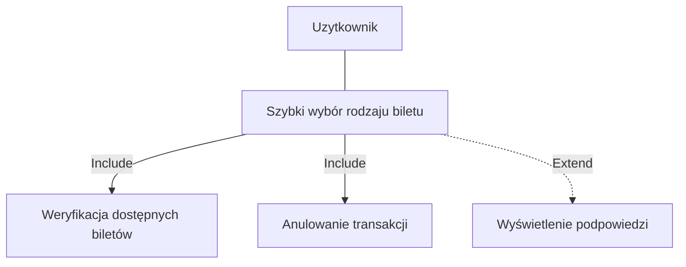
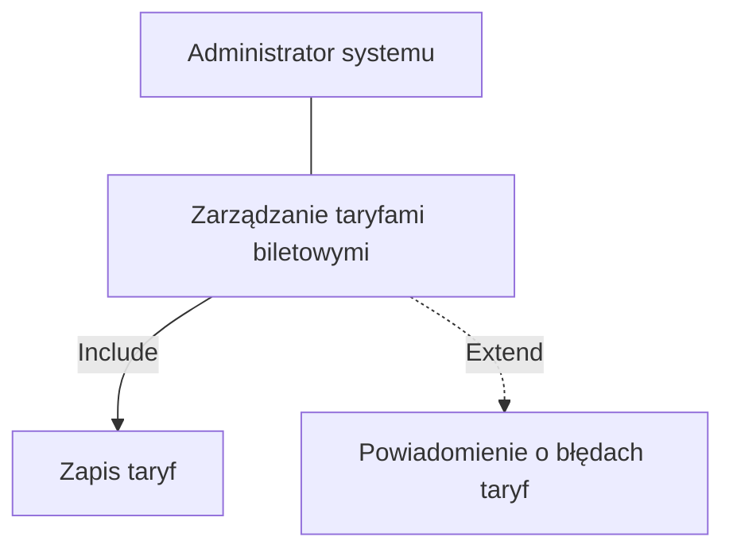
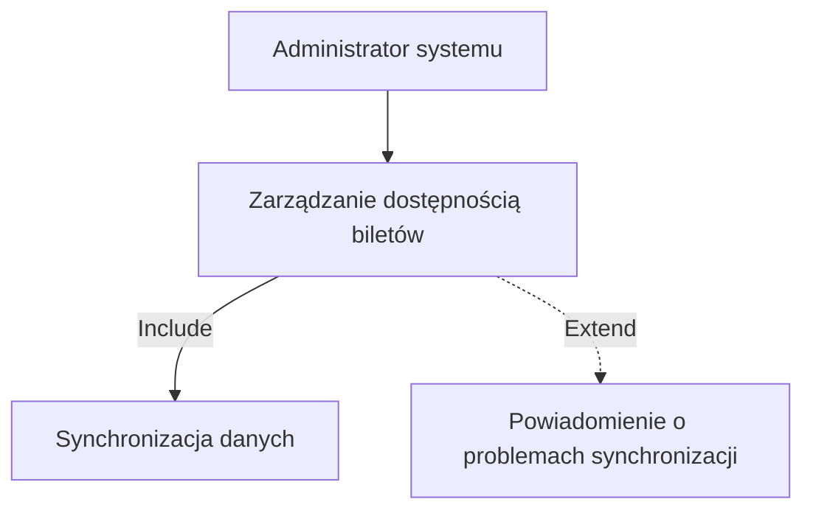
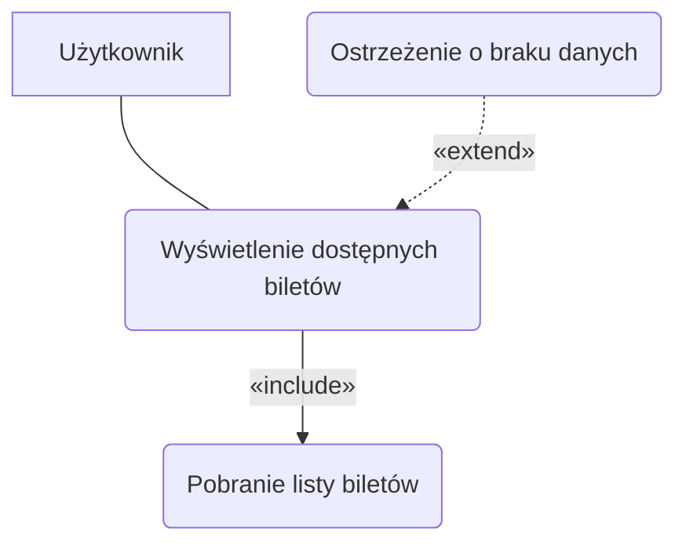
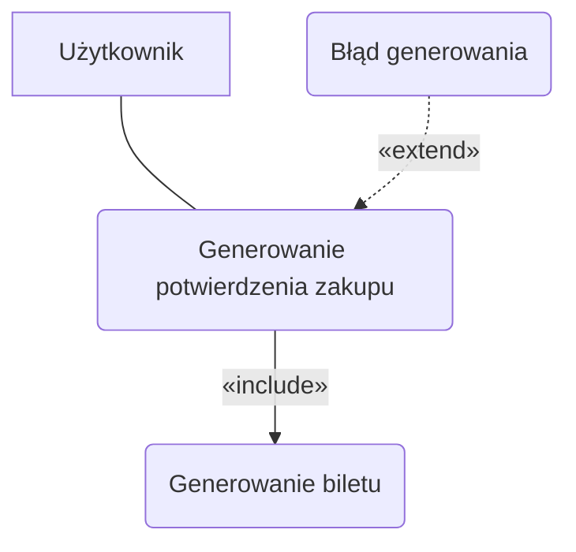

## Diagramy przypadków użycia

### Wybór języka




### Szybki wybór rodzaju biletu


### Zarządzanie taryfami biletowymi


### Zarządzanie dostępnością biletów


### Wyświetlenie dostępnych biletów



### Generowanie potwierdzenia zakupu



## DIAGRAMY SEKWENCJI

### DIAGRAM SEKWENCJI DLA PRZYPADKU UŻYCIA GENEROWANIA POTWIERDZENIA ZAKUPU
- AKTOR: BILETOMAT
- OBIEKTY: SYSTEM TRANSAKCYJNY, MODUŁ DRUKOWANIA, INTERFEJS UŻYTKOWNIKA, UŻYTKOWNIK
- KOLEJNOŚĆ KOMUNIKATÓW (SCENARIUSZ GŁÓWNY):
 
  o SYSTEM TRANSAKCYJNY WYSYŁA POTWIERDZENIE TRANSAKCJI DO BILETOMATU.
  
  o BILETOMAT PRZEKAZUJE ŻĄDANIE DO MODUŁU DRUKOWANIA.
  
  o MODUŁ DRUKOWANIA GENERUJE BILET I ZWRACA STATUS DO BILETOMATU.
  
  o BILETOMAT INFORMUJE UŻYTKOWNIKA PRZEZ INTERFEJS: "ODBIERZ BILET".
  
  o UŻYTKOWNIK ODBIERA BILET.
  
  o BILETOMAT POTWIERDZA ZAKOŃCZENIE DO SYSTEMU TRANSAKCYJNEGO.
  
- SCENARIUSZ ALTERNATYWNY 1 (BŁĄD GENEROWANIA):
  
  o MODUŁ DRUKOWANIA WYKRYWA BŁĄD (BRAK PAPIERU/AWARIA).
  
  o MODUŁ DRUKOWANIA ZWRACA STATUS BŁĘDU DO BILETOMATU.
  
  o BILETOMAT WYŚWIETLA UŻYTKOWNIKOWI: "BŁĄD. SKONTAKTUJ SIĘ Z OBSŁUGĄ".
  
  o BILETOMAT WYSYŁA POWIADOMIENIE O BŁĘDZIE DO SYSTEMU TRANSAKCYJNEGO.

```mermaid
sequenceDiagram
    participant ST as System Transakcyjny
    participant B as Biletomat
    participant MD as Moduł Drukowania
    participant IU as Interfejs Użytkownika
    participant U as Użytkownik

    ST->>B: Potwierdzenie transakcji
    B->>MD: Żądanie generowania biletu
    
    alt Scenariusz główny
        MD-->>B: Bilet gotowy
        B->>IU: Komunikat o odbiorze
        IU->>U: "Odbierz bilet"
        U-->>U: Odbiór biletu
        IU-->>B: Potwierdzenie
        B->>ST: Transakcja zakończona
        ST-->>B: OK
    else Błąd generowania
        MD-->>B: Status błędu
        B->>IU: Komunikat o błędzie
        IU->>U: "Błąd. Skontaktuj się z obsługą"
        B->>ST: Powiadomienie o błędzie
        ST-->>B: OK
    end
  ```

### DIAGRAM SEKWENCJI DLA PRZYPADKU UŻYCIA WYŚWIETLENIA DOSTĘPNYCH BILETÓW
- AKTOR: BILETOMAT
- OBIEKTY: SYSTEM CENTRALNY, INTERFEJS UŻYTKOWNIKA, UŻYTKOWNIK
- KOLEJNOŚĆ KOMUNIKATÓW (SCENARIUSZ GŁÓWNY):
 
  o BILETOMAT URUCHAMIA EKRAN POWITALNY PRZEZ INTERFEJS.
  
  o BILETOMAT POBIERA LISTĘ BILETÓW Z SYSTEMU CENTRALNEGO (INCLUDE: AKTUALIZACJA BILETÓW).
  
  o BILETOMAT WYŚWIETLA BILETY UŻYTKOWNIKOWI PRZEZ INTERFEJS.
  
  o BILETOMAT CZEKA NA WYBÓR UŻYTKOWNIKA.
  
- SCENARIUSZ ALTERNATYWNY 1 (AWARIA SIECI - EXTEND):
  
  o SYSTEM CENTRALNY ZWRACA BŁĄD POŁĄCZENIA.
  
  o BILETOMAT WYŚWIETLA OSTRZEŻENIE UŻYTKOWNIKOWI.

```mermaid
sequenceDiagram
    participant B as Biletomat
    participant SC as System Centralny
    participant IU as Interfejs Użytkownika
    participant U as Użytkownik

    B->>IU: Uruchomienie ekranu powitalnego
    IU-->>B: OK
    
    B->>SC: Żądanie listy biletów (include: aktualizacja)
    
    alt Scenariusz główny
        SC-->>B: Lista biletów
        B->>IU: Wyświetl bilety
        IU->>U: Kategorie i szczegóły biletów
        U-->>IU: Przeglądanie
        IU-->>B: Oczekiwanie na wybór
    else Awaria sieci (extend)
        SC-->>B: Błąd połączenia
        B->>IU: Komunikat o błędzie
        IU->>U: "Brak danych. Skontaktuj się z obsługą"
    end
```

