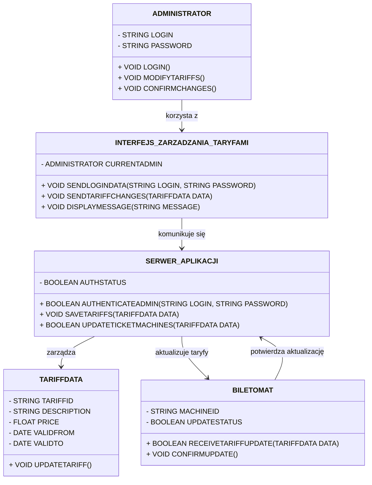
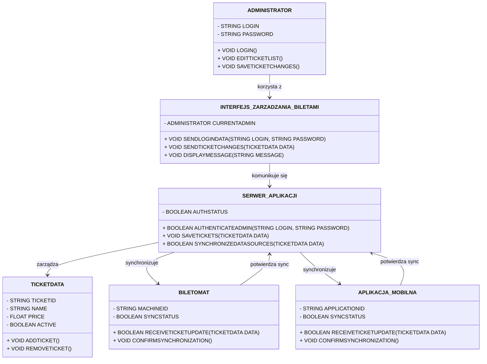

# OPIS DLA SCENARIUSZU "Zarządzanie dostępnością biletów"
## OPIS KLAS
### KLASY
### ADMINISTRATOR

ATRYBUTY:
STRING LOGIN, STRING PASSWORD

METODY:
VOID LOGIN(),
VOID MODIFYTARIFFS(),
VOID CONFIRMCHANGES()

### INTERFEJS_ZARZADZANIA_TARYFAMI

ATRYBUTY:
ADMINISTRATOR CURRENTADMIN

METODY:
VOID SENDLOGINDATA(STRING LOGIN, STRING PASSWORD),
VOID SENDTARIFFCHANGES(TARIFFDATA DATA),
VOID DISPLAYMESSAGE(STRING MESSAGE)

### SERWER_APLIKACJI

ATRYBUTY:
BOOLEAN AUTHSTATUS

METODY:
BOOLEAN AUTHENTICATEADMIN(STRING LOGIN, STRING PASSWORD),
VOID SAVETARIFFS(TARIFFDATA DATA),
BOOLEAN UPDATETICKETMACHINES(TARIFFDATA DATA)

### BILETOMAT

ATRYBUTY:
STRING MACHINEID,
BOOLEAN UPDATESTATUS

METODY:
BOOLEAN RECEIVETARIFFUPDATE(TARIFFDATA DATA),
VOID CONFIRMUPDATE()

### TARIFFDATA

ATRYBUTY:
STRING TARIFFID,
STRING DESCRIPTION,
FLOAT PRICE,
DATE VALIDFROM,
DATE VALIDTO

METODY:
VOID UPDATETARIFF()

### RELACJE:

ADMINISTRATOR KORZYSTA Z INTERFEJS_ZARZADZANIA_TARYFAMI DO ZARZĄDZANIA TARYFAMI (ASOCJACJA).

INTERFEJS_ZARZADZANIA_TARYFAMI KOMUNIKUJE SIĘ Z SERWER_APLIKACJI W CELU AUTORYZACJI ORAZ PRZESYŁANIA ZMIAN.

SERWER_APLIKACJI ZARZĄDZA DANYMI TYPU TARIFFDATA.

SERWER_APLIKACJI WYSYŁA ZAKTUALIZOWANE TARYFY DO OBIEKTÓW BILETOMAT (ASOCJACJA WIELOKROTNA).

BILETOMAT POTWIERDZA LUB ODRZUCA AKTUALIZACJĘ TARYF.

W PRZYPADKU BRAKU POTWIERDZENIA ZE STRONY BILETOMAT, SERWER_APLIKACJI ZGŁASZA BŁĄD DO INTERFEJS_ZARZADZANIA_TARYFAMI.

# DIAGRAM KLAS: 

# OPIS DLA SCENARIUSZU "Zarządzanie taryfami biletowymi"

## OPIS KLAS
### KLASY
### ADMINISTRATOR

ATRYBUTY:
STRING LOGIN,
STRING PASSWORD

METODY:
VOID LOGIN(),
VOID EDITTICKETLIST(),
VOID SAVETICKETCHANGES()

### INTERFEJS_ZARZADZANIA_BILETAMI

ATRYBUTY:
ADMINISTRATOR CURRENTADMIN

METODY:
VOID SENDLOGINDATA(STRING LOGIN, STRING PASSWORD),
VOID SENDTICKETCHANGES(TICKETDATA DATA),
VOID DISPLAYMESSAGE(STRING MESSAGE)

### SERWER_APLIKACJI

ATRYBUTY:
BOOLEAN AUTHSTATUS

METODY:
BOOLEAN AUTHENTICATEADMIN(STRING LOGIN, STRING PASSWORD),
VOID SAVETICKETS(TICKETDATA DATA),
BOOLEAN SYNCHRONIZEDATASOURCES(TICKETDATA DATA)

### BILETOMAT

ATRYBUTY:
STRING MACHINEID,
BOOLEAN SYNCSTATUS

METODY:
BOOLEAN RECEIVETICKETUPDATE(TICKETDATA DATA),
VOID CONFIRMSYNCHRONIZATION()

### APLIKACJA_MOBILNA

ATRYBUTY:
STRING APPLICATIONID,
BOOLEAN SYNCSTATUS

METODY:
BOOLEAN RECEIVETICKETUPDATE(TICKETDATA DATA),
VOID CONFIRMSYNCHRONIZATION()

### TICKETDATA

ATRYBUTY:
STRING TICKETID,
STRING NAME,
FLOAT PRICE,
BOOLEAN ACTIVE

METODY:
VOID ADDTICKET(),
VOID REMOVETICKET()

### RELACJE:

ADMINISTRATOR KORZYSTA Z INTERFEJS_ZARZADZANIA_BILETAMI DO ZARZĄDZANIA LISTĄ BILETÓW (ASOCJACJA).

INTERFEJS_ZARZADZANIA_BILETAMI PRZESYŁA DANE LOGOWANIA ORAZ ZMIANY DO SERWER_APLIKACJI.

SERWER_APLIKACJI ZARZĄDZA OBIEKTAMI TYPU TICKETDATA.

SERWER_APLIKACJI SYNCHRONIZUJE DANE Z BILETOMAT ORAZ APLIKACJA_MOBILNA (ASOCJACJA WIELOKROTNA).

BILETOMAT ORAZ APLIKACJA_MOBILNA POTWIERDZAJĄ LUB ODRZUCAJĄ SYNCHRONIZACJĘ.

W PRZYPADKU NIEPOWODZENIA SYNCHRONIZACJI SERWER_APLIKACJI ZWRACA INFORMACJĘ O BŁĘDZIE DO INTERFEJS_ZARZADZANIA_BILETAMI.

# DIAGRAM KLAS

