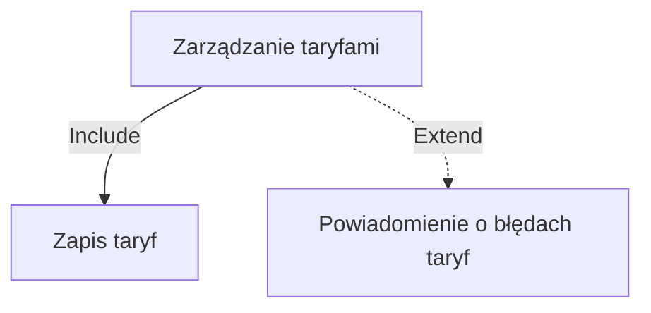

## DIAGRAMY PRZYPADKÓW UŻYCIA
### SZYBKI WYBÓR RODZAJU BILETU

```mermaid
flowchart TD
    A[Zarządzanie taryfami]
    B[Zapis taryf]
    C[Powiadomienie o błędach taryf]

    A -->|Include| B
    A -.->|Extend| C
```

