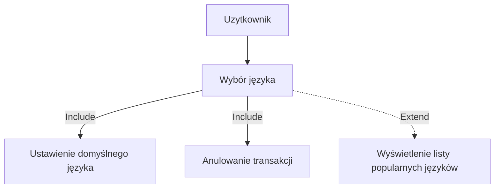
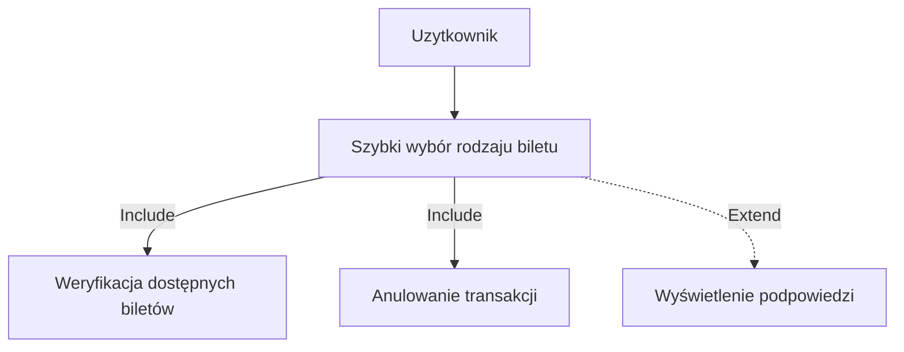

## Diagramy przypadków użycia

### Wybór języka

```mermaid
flowchart TD
    N[Uzytkownik] --> A[Wybór języka]

    A --> |Include| B[Ustawienie domyślnego języka]
    A --> |Include| C[Anulowanie transakcji]

    %% Relacja Extend (opcjonalna)
    A -.->|Extend| F[Wyświetlenie listy popularnych języków]
```

### Szybki wybór rodzaju biletu

```mermaid
flowchart TD
    N[Uzytkownik] --> A[Szybki wybór rodzaju biletu]

    A --> |Include| B[Weryfikacja dostępnych biletów]
    A --> |Include| C[Anulowanie transakcji]

    %% Relacja Extend (opcjonalna)
    A -.->|Extend| F[ Wyświetlenie podpowiedzi ]
```
